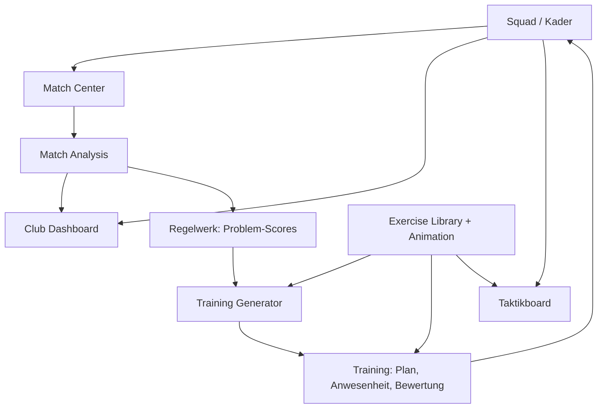

# PlayLense – Planung

Stand: September 2026. Dieses Dokument ist die verbindliche Planungsgrundlage. Details zu
Daten, Events, Regeln und Animationen stehen in den Nachbardokumenten.

---

## 1. Ausgangslage und Ziel

- Rolle: Co-Trainer mit Trainerlizenz, übernimmt einzelne Trainingseinheiten, bespricht Taktik mit
  und arbeitet hauptsächlich als Analyst.
- Liga: Bayern, A-Klasse. Videoaufzeichnungen sind dort nicht zulässig. Daten entstehen also nur
  durch Beobachtung am Spielfeldrand.
- Gerät: iPad (Tablet), am Spielfeldrand ohne verlässliches Netz. Die App muss vollständig offline
  funktionieren.
- Ein Beobachter. Es gibt keinen zweiten Tagger und keine Nachbearbeitung per Video.

Ziel ist ein „Coach & Analyst OS“ in einer App:

1. Live-Erfassung von Spielstatistiken (wichtigster Teil).
2. Spielanalyse mit Halbzeit- und Endbericht, Zonen, Zeitfenstern, Trends.
3. Spieler- und Vereinsdatenbank mit Dashboards.
4. Übungsbibliothek mit 2D-Animation von oben plus Beschreibung.
5. Regelbasierter Trainingsgenerator: Spielprobleme → Trainingsziele → Übungen → bearbeitbarer Plan.
6. Training tracken (Anwesenheit, Bewertung, Spielerflags).
7. Taktikboard.

---

## 2. Leitplanken (nicht verhandelbar)

| Leitplanke | Konsequenz für den Bau |
|---|---|
| Offline-first | Keine Server-Abhängigkeit, kein Login, kein Cloud-Zwang. Alles lokal in SQLite. Netz ist ein optionales Extra (Export), nie eine Voraussetzung. |
| Zwei-Sekunden-Regel | Jedes Live-Event: 1 Tap Event + 1 Tap Zone (+ 1 Tap Ergebnis bei Abschluss). Kein Pflichtfeld darüber hinaus. Alles Weitere ist nachträglich editierbar. |
| Nichts geht verloren | Append-only Event-Log, jedes Event wird sofort in die Datenbank geschrieben. Uhr basiert auf Zeitstempeln, nicht auf Zählern. |
| Ein Beobachter | Erfassungsprofile (Voll / Kompakt / Minimal), damit die Erfassung auch dann funktioniert, wenn du gleichzeitig coachst. |
| Konsistente Definitionen | Jeder Event-Typ hat eine schriftliche Definition (siehe Event-Katalog). Ohne feste Definitionen sind Saisonvergleiche wertlos. |
| Nachvollziehbarkeit | Regelwerk als Daten (JSON), in der App einsehbar und später editierbar. Jeder Vorschlag hat ein „Warum“. |
| Datenschutz | Spielerdaten sind personenbezogen. Sparsame Felder, alles lokal, Export optional mit Passwort. Kein Tracking, keine Analytics. |

---

## 3. Technologie-Entscheidung

### 3.1 Optionen

| Option | Offline-Tauglichkeit | Bewertung für PlayLense |
|---|---|---|
| **Native SwiftUI (iPadOS)** | Sehr gut. SQLite-Datei im App-Container, keine Löschung durch das System, iCloud-Gerätebackup automatisch. | Beste Wahl. Volle Kontrolle über Touch, Haptik, Canvas-Animationen, PencilKit, PDF-Export. Kein Laufzeit-Overhead. Nur ein Zielgerät, also kein Cross-Platform-Bedarf. |
| Flutter | Sehr gut (SQLite via drift). Custom Painter für Animationen. | Gute Alternative, falls später Android nötig wird. Mac für den iOS-Build trotzdem nötig. |
| React Native / Expo | Gut (SQLite via expo-sqlite). | Möglich, aber Animationen und Canvas sind mehr Aufwand. Ohne Mac nur über Cloud-Builds. |
| PWA (Web-App im Safari) | **Riskant.** iOS räumt Web-Speicher nach LRU-Prinzip auf, hat harte Cache-Limits (~50 MB) und eine 7-Tage-Regel für script-schreibbaren Speicher bei seltener Nutzung. Persistent-Storage-API hilft, ist aber an Benachrichtigungs-Berechtigungen gebunden. | Ausgeschlossen. Ein verlorenes Saison-Event-Log wegen Speicherbereinigung ist inakzeptabel. |

Quellen zu den PWA-Limits: [MagicBell: PWA iOS Limitations](https://www.magicbell.com/blog/pwa-ios-limitations-safari-support-complete-guide),
[MobiLoud: PWAs on iOS 2026](https://www.mobiloud.com/blog/progressive-web-apps-ios/),
[Apple Developer Forums: Mobile Safari offline storage](https://developer.apple.com/forums/thread/88313).

### 3.2 Empfehlung: Native SwiftUI

| Baustein | Wahl | Grund |
|---|---|---|
| UI | SwiftUI, iPadOS 17+ | Landscape-Layouts, große Touch-Ziele, TimelineView/Canvas für Animationen. |
| Datenbank | SQLite über **GRDB.swift** | Robust, Migrationen, echtes SQL für Statistik-Abfragen, WAL-Modus. SwiftData wäre einfacher, aber für Aggregationen über tausende Events schwächer. |
| Animationen | SwiftUI `Canvas` + `TimelineView` | Keyframe-Interpolation ist wenige hundert Zeilen. Kein SpriteKit nötig. |
| Freihand im Taktikboard | PencilKit | Pfeile und Räume mit Finger oder Pencil. |
| Diagramme | Swift Charts | Trends, Zeitverläufe, Zonen-Heatmaps. |
| Export | `FileDocument`, `ShareLink`, `UIGraphicsPDFRenderer` | Bundle-Export, AirDrop, PDF-Berichte, alles offline. |
| Tests | XCTest | Vor allem für Statistik-Berechnung, Regelwerk und Generator (rein logische Module). |

Architektur in Schichten, damit Logik ohne UI testbar bleibt:

```
UI (SwiftUI Views)
  └── Feature-Module (MatchCenter, Analysis, Squad, Training, Library, Generator, Tactics, Dashboard)
        └── Domain (reine Swift-Structs, Statistik-Engine, Regelwerk, Generator)
              └── Persistence (GRDB, Migrationen, Export/Import)
```

### 3.3 Praktische Voraussetzungen

- **Mac mit Xcode** ist nötig. Ohne Mac bleibt als Ausweichweg Swift Playgrounds auf dem iPad,
  das ist für dieses Projekt aber zu eng.
- **Apple-Developer-Account (99 €/Jahr) ist empfohlen.** Mit einem kostenlosen Apple-ID-Profil läuft
  eine per Xcode installierte App nur 7 Tage und muss dann neu installiert werden. Mit dem bezahlten
  Account hält ein Build ein Jahr (Ad-hoc) oder 90 Tage (TestFlight). Für eine Saison am Spielfeldrand
  ist die 7-Tage-Variante nicht tragbar.
- Kein App-Store-Release nötig. Die App bleibt privat.

---

## 4. Offline-Architektur

### 4.1 Datenhaltung

- Eine SQLite-Datei `playlense.sqlite` in `Application Support` (nicht in `Caches`, das darf das
  System leeren). WAL-Modus, `FileProtection.completeUntilFirstUserAuthentication`, damit die
  Datei auch nach einem Neustart im gesperrten Zustand beschreibbar bleibt.
- Übungs-Animationen, Regelwerk und Taktik-Presets liegen als JSON-Spalten in der Datenbank. Keine
  losen Dateien, die beim Export vergessen werden könnten.
- Versionierte Migrationen ab Tag 1. Jede Schemaänderung ist ein Migrationsschritt.

### 4.2 Event-Sourcing für Spiele

Das Spiel wird nicht als „Statistik-Tabelle“ gespeichert, sondern als **Event-Log**: eine
Zeile pro Aktion mit Zeitpunkt, Seite, Typ, Zone, optionalem Spieler und Ergebnis. Alle
Statistiken (Abschlüsse, Zonen-Verteilung, Zeitfenster, Vor/Nach-Wechsel) werden daraus berechnet.

Vorteile:

- Nachträgliche Korrekturen sind trivial (Event editieren, Statistik neu berechnen).
- Neue Kennzahlen lassen sich rückwirkend auf alte Spiele anwenden.
- Undo ist ein Soft-Delete auf dem letzten Event.
- Zeitfenster-Analysen („letzte 15 Minuten“, „seit Wechsel“) sind einfache Filter.

Abgeleitete Werte (Saisondurchschnitte, Problem-Scores) werden in Cache-Tabellen gehalten, die
jederzeit vollständig neu aufgebaut werden können.

### 4.3 Ein Gerät, aber Sync-fähig gebaut

Es gibt genau ein iPad und keinen Server. Dadurch gibt es keine Sync-Konflikte. Trotzdem werden
von Anfang an UUIDs als Primärschlüssel, `createdAt`/`updatedAt` und ein Schema-Version-Feld
verwendet. Falls später ein zweites Gerät oder iCloud-Sync dazukommt, muss das Datenmodell
nicht umgebaut werden.

### 4.4 Backup und Export

| Weg | Wann | Was |
|---|---|---|
| iCloud-Gerätebackup | automatisch, durch iPadOS | Kompletter App-Container inkl. Datenbank. Kostet nichts, muss nur eingeschaltet sein. |
| **Bundle-Export** `.playlense` | manuell, plus automatisch nach jedem Spiel | ZIP mit Datenbank-Snapshot und lesbarem JSON pro Entität. Ablage in „Dateien“ (lokal oder iCloud Drive, sobald Netz da ist), AirDrop, Mail. |
| CSV-Export | manuell | Event-Log, Spielerstatistiken, Saisontabellen für Excel. |
| PDF-Bericht | nach Halbzeit/Spiel | Halbzeit- und Endbericht zum Weitergeben an den Trainer. |
| Import | manuell | `.playlense`-Bundle einlesen, Merge nach UUID (neuere `updatedAt` gewinnt). |

Der automatische Export nach Spielende wird in eine Warteschlange gelegt, falls iCloud Drive
gerade nicht erreichbar ist, und beim nächsten App-Start nachgeholt.

### 4.5 Robustheit während des Spiels

- **Uhr über Zeitstempel.** Gespeichert wird „Anpfiff 1. Halbzeit um 15:00:07“. Die Spielminute
  wird daraus berechnet. App-Absturz, Sperrbildschirm oder Neustart ändern die Uhr nicht.
- **Sofort-Persistenz.** Jeder Tap, der ein Event abschließt, ist eine Transaktion. Kein
  „Speichern“-Button, kein Batch.
- **Wiederaufnahme.** Beim Start prüft die App, ob ein Spiel im Status „läuft“ ist, und springt
  direkt ins Match Center.
- **Bildschirm bleibt an** (Idle-Timer aus) solange das Match Center offen ist.
- **Empfehlung fürs Gerät:** Flugmodus oder „Nicht stören“, Geführter Zugriff (Guided Access)
  gegen versehentliches Wischen, Helligkeit hoch, Akku vorher voll. Die App zeigt diese
  Checkliste vor dem Anpfiff einmal an.
- **Wetter.** Regen stört kapazitive Touch-Erkennung. Großzügige Touch-Ziele (mind. 64 pt),
  keine Wischgesten für kritische Aktionen, alles über Taps.

### 4.6 Datenschutz

- Nur nötige Spielerdaten: Name, Rückennummer, Position, Fuß, optional Geburtsjahr. Keine
  Adressen, keine Gesundheitsdaten außer „verletzt ja/nein“.
- Export optional mit Passphrase verschlüsselt (AES über CryptoKit).
- Keine Netzwerkaufrufe außer durch den Nutzer ausgelöste Exporte.

---

## 5. Module und Abhängigkeiten



| # | Modul | Priorität | Kurzbeschreibung |
|---|---|---|---|
| 1 | Match Center | **höchste** | Live-Tagging, Spielfeld, Flags, Uhr, Aufstellung, Wechsel, Halbzeitbericht, Live-Insights |
| 2 | Match Analysis | hoch | Statistiken, Zonen, Zeitverläufe, Zeitfenster, Vor/Nach-Wechsel, Endbericht, PDF |
| 3 | Squad | hoch | Spielerprofile, Einsatzzeiten, Stats, Coach-Ratings, Entwicklung |
| 4 | Exercise Library | mittel | Übungen mit Attributen, Tags, Coaching Points, Variationen, 2D-Animation |
| 5 | Training | mittel | Einheit planen, Anwesenheit, Übungsbewertung, Spielerflags |
| 6 | Training Generator | mittel | Regelwerk → Trainingsziele → Übungsauswahl → bearbeitbarer Plan |
| 7 | Tactics | niedrig | Formationen, Gegnerformation, Zeichnen, Presets, Animation |
| 8 | Club Dashboard | niedrig | Saisonwerte, Trends, Spielerentwicklung |

---

## 6. Match Center im Detail

### 6.1 Vor dem Spiel

1. **Spiel anlegen:** Gegner, Datum, Heim/Auswärts, Wettbewerb, Spielrichtung in der 1. Halbzeit
   („wir spielen auf das linke/rechte Tor“, aus deiner Sitzposition).
2. **Aufstellung:** Formation aus Vorlagen (4-2-3-1, 4-4-2, 4-3-3, 3-5-2, 5-3-2 …) wählen,
   Spieler per Drag auf die Positionen ziehen, Rest auf die Bank. Positionen werden als
   Positionsschlüssel gespeichert (TW, LV, LIV, RIV, RV, DM, ZM, LM, RM, OM, LA, RA, ST).
3. **Erfassungsprofil** wählen:
   - **Voll:** alle Events des Katalogs.
   - **Kompakt:** Ballgewinn, Ballverlust, Abschluss, Großchance, Angriff, Standard, Flags, Notiz.
   - **Minimal:** Abschlüsse beider Teams, Tore, Flags, Notizen. Für Spiele, in denen du selbst coachst.
4. **Vor-Anpfiff-Checkliste** (Flugmodus, Helligkeit, Akku, Guided Access).

### 6.2 Bildschirm (Querformat)

```
┌────────────────────────────────────────────────────────────────────────────┐
│ 1. HZ  27:34    TSV Thundorf  1 : 0  SV Gegner         ⏸ Halbzeit   ↶ Undo │
├───────────────┬────────────────────────────────────┬───────────────────────┤
│ WIR           │           GEGNER-TOR  ▲            │ GEGNER                │
│ ┌───────────┐ │   ┌──────────┬──────────┬──────────┐│ ┌───────────┐         │
│ │ Ballgewinn│ │   │ L  Angr. │ Z  Angr. │ R  Angr. ││ │ Ballgewinn│         │
│ ├───────────┤ │   ├──────────┼──────────┼──────────┤│ ├───────────┤         │
│ │ Ballverl. │ │   │ L  Mitte │ Z  Mitte │ R  Mitte ││ │ Ballverl. │         │
│ ├───────────┤ │   ├──────────┼──────────┼──────────┤│ ├───────────┤         │
│ │ Abschluss │ │   │ L  Eig.  │ Z  Eig.  │ R  Eig.  ││ │ Abschluss │         │
│ ├───────────┤ │   └──────────┴──────────┴──────────┘│ ├───────────┤         │
│ │ Großchance│ │           EIGENES TOR  ▼            │ │ Großchance│         │
│ ├───────────┤ │                                     │ ├───────────┤         │
│ │ Angriff   │ │   🚩 Flag    📝 Notiz    🔁 Wechsel  │ │ Angriff   │         │
│ ├───────────┤ │   ⬆ Konter   🟨 Karte    ✚ Verletzt │ ├───────────┤         │
│ │ Standard  │ │                                     │ │ Standard  │         │
│ └───────────┘ │                                     │ └───────────┘         │
├───────────────┴────────────────────────────────────┴───────────────────────┤
│  1   2   3   4   5   6   7   8   9  10  11    │ 27:12 Ballverlust · Z/Mitte│
│  Spielerleiste: Tap = nächstes Event gehört   │ 26:40 Angriff · rechts     │
│  diesem Spieler. Bank ausgegraut.             │ 25:58 Abschluss #9 · vorbei│
└───────────────────────────────────────────────┴────────────────────────────┘
```

- Linke Spalte: eigene Team-Events. Rechte Spalte: dieselben Events für den Gegner.
- Mitte: Spielfeld als 3×3-Raster (Drittel × Seite), **immer aus unserer Angriffsperspektive**
  gezeichnet (Gegner-Tor oben). Mehr Auflösung (3×5) ist im Datenmodell vorgesehen, aber für
  einen Beobachter im Live-Betrieb zu fein.
- Unten: Spielerleiste mit Rückennummern und Event-Log der letzten Aktionen.
- Farben: kräftige, hochkontrastige Flächen (Sonne). Eigene Events blau, Gegner rot, neutral grau.
- Haptisches Feedback bei jedem gespeicherten Event, damit du nicht aufs Display schauen musst.

### 6.3 Erfassungsfluss (Zwei-Stufen-System)

```
Tap "Ballverlust"  →  Button leuchtet, Spielfeld pulsiert  →  Tap auf Zone  →  gespeichert (Haptik)
```

- Stufe 1: Event-Button. Stufe 2: Zone auf dem Spielfeld.
- Kein zweiter Tap innerhalb von 4 Sekunden → Event wird **ohne Zone** gespeichert (nicht verworfen).
  Lieber ein Event ohne Zone als gar keins.
- **Abschluss** hat Stufe 3: Ergebnis-Overlay mit vier großen Buttons
  `Tor · aufs Tor · vorbei · geblockt`. Abschlüsse sind selten genug (10–25 pro Spiel), dass drei
  Taps vertretbar sind. Bei `Tor` erhöht sich der Spielstand automatisch.
- **Angriff** braucht keine Zone, nur die Seite: Stufe 2 ist ein Tap auf eine der drei Spalten.
- **Standard**: Stufe 2 ist `Ecke · Freistoß · Einwurf · Elfmeter` statt Zone.
- **Spielerzuordnung:** Tap auf eine Nummer in der Spielerleiste → die Nummer leuchtet → das
  nächste Event bekommt diesen Spieler. Alternativ Long-Press auf einen Event-Button öffnet
  die Spielerauswahl. Spielerzuordnung ist **immer optional**.
- **Undo** entfernt das letzte Event (Soft-Delete, im Log wiederherstellbar).
- **Log-Zeile antippen** öffnet einen Mini-Editor: Zone, Spieler, Ergebnis, Minute korrigieren, löschen.

Tap-Budget je Event steht im Event-Katalog. Ziel: Median unter 2 Sekunden, kein Event über 3 Taps.

### 6.4 Zonen und Seitenwechsel

- Zonen werden **normalisiert aus eigener Angriffsperspektive** gespeichert:
  `zone_row ∈ {eigenes_drittel, mittelfeld, angriffsdrittel}`, `zone_lane ∈ {links, zentrum, rechts}`.
- Auch Gegner-Events werden in **unserer** Perspektive gespeichert. „Gegner greift über unsere
  linke Seite an“ ist damit direkt ablesbar, ohne Umrechnung.
- Die Spielrichtung („wir spielen 1. Halbzeit nach links“) dient nur der Darstellung: Nach der
  Halbzeit wird die Darstellung automatisch gespiegelt, damit das Raster auf dem iPad zu dem passt,
  was du auf dem Platz siehst. Die gespeicherten Zonen bleiben gleich.
- Weil du eventuell die Seite wechselst (Trainerbank), gibt es einen Schalter
  „Ich sitze auf der anderen Seite“, der die Darstellung ebenfalls spiegelt.

### 6.5 Uhr und Spielphasen

Zustände: `nicht_gestartet → hz1_laeuft → halbzeit → hz2_laeuft → beendet`
(Verlängerung als optionale weitere Perioden für Pokalspiele).

- Anpfiff/Abpfiff je Halbzeit speichern einen Zeitstempel. Die Minute wird berechnet, die Uhr
  läuft auch bei gesperrtem Gerät weiter.
- Nachspielzeit läuft einfach über 45:00 hinaus (45+2 wird als 45+2 angezeigt).
- Manuelle Korrektur der Anpfiffzeit ist möglich (falls du 30 Sekunden zu spät gedrückt hast).
- Events speichern Periode, Spielsekunde und die reale Uhrzeit.

### 6.6 Wechsel, Karten, Verletzungen

- Wechsel: `Raus (vom Feld) → Rein (von der Bank) → Position` (Position vorbelegt mit der des
  Ausgewechselten). Setzt einen **Marker** im Log; Einsatzzeiten werden daraus berechnet.
- Karten und Verletzungen sind Events mit Spieler. Rote Karte entfernt den Spieler aus der Leiste.
- Für den Gegner gibt es einen einfachen „Gegner-Wechsel“-Marker ohne Spielerdaten, weil auch
  gegnerische Wechsel ein Analysepunkt sind (siehe Zeitfenster).

### 6.7 Quick Flags

Ein Tap auf 🚩 öffnet den Flag-Katalog (zwei Spalten: Defensive / Offensive, darunter Positiv).
Ein Tap auf einen Flag speichert `Minute + Flag`, optional danach eine Zone. Der Katalog ist im
Event-Katalog definiert und in den Einstellungen editierbar. Häufigkeit eines Flags im Spiel
erhöht sein Gewicht im Regelwerk.

### 6.8 Halbzeit- und Endbericht

Beim Tap auf „Halbzeit“ bzw. „Abpfiff“ erzeugt die App sofort einen Bericht:

- Auffälligkeiten (regelbasiert, sortiert nach Gewicht), z. B. „8 Ballverluste im Zentrum“,
  „5 gegnerische Angriffe über unsere linke Seite“, „4× Flag Abstand IV–ZM“.
- Abschlüsse, Großchancen, Ballgewinne/-verluste im Vergleich.
- Angriffsrichtung beider Teams in Prozent.
- Zonen-Heatmap der Ballverluste und Ballgewinne.
- Coach Notes (Notizen aus dem Spiel).
- Live-Insights, die während der Halbzeit ausgelöst wurden.

Der Bericht ist eine Seite, groß genug, um ihn dem Trainer in der Kabine zu zeigen. Export als
PDF und als Klartext (zum Vorlesen oder Abtippen) offline möglich.

### 6.9 Live-Insights

Kleine Regel-Engine, die nach jedem Event über ein gleitendes Fenster läuft:

- „4 der letzten 5 Ballverluste im linken Zentrum.“
- „6 von 8 Gegner-Angriffen der letzten 15 Minuten über unsere linke Seite.“
- „Seit dem Wechsel in Minute 62: Abschlüsse 1 : 5.“

Insights erscheinen als dezentes Banner oben, verschwinden nach 8 Sekunden von allein und werden
im Log gespeichert. Sie unterbrechen nie die Erfassung. Regeln sind im Regelwerk-Dokument definiert.

### 6.10 Zeitfenster und Wechselmarker

Jederzeit umschaltbar: `Gesamt · 1. HZ · 2. HZ · letzte 15 Min · seit letztem Wechsel · seit
Gegner-Wechsel · benutzerdefiniert`. Alle Kennzahlen im Match Center und in der Analyse
reagieren auf das gewählte Fenster. Wechsel (eigene und gegnerische) sind Marker auf der
Zeitachse und lassen sich direkt als Fenstergrenzen auswählen.

### 6.11 Training des Workflows

Vor dem ersten Ernstfall: ein beliebiges Fußballspiel auf Video (TV, Stream) mit der App taggen.
So kalibrierst du die Definitionen und stellst fest, welche Events du in Echtzeit wirklich
schaffst. Das ist auch der beste Test für das Erfassungsprofil.

---

## 7. Match Analysis

Nach dem Spiel (und während, in einem zweiten Tab):

- **Übersicht:** Ergebnis, Abschlüsse, Großchancen, Ballgewinne/-verluste, Angriffe je Seite,
  Standards, Pressing, Konter. Jeweils Wir : Gegner.
- **Zonen:** 3×3-Heatmap je Event-Typ und Seite. Umschaltbar Wir/Gegner.
- **Zeitverlauf:** Balken pro 15-Minuten-Segment (Abschlüsse, Ballverluste, Angriffe), Marker für
  Tore, Wechsel, Karten.
- **Zeitfenster-Vergleich:** zwei Fenster nebeneinander (z. B. vor/nach Wechsel #14).
- **Flags:** Häufigkeit pro Flag, mit Minuten.
- **Spieler:** Tabelle der spielerbezogenen Events, Einsatzminuten.
- **Bericht:** Endbericht wie Halbzeitbericht, plus Problem-Scores aus dem Regelwerk und der
  Button „Trainingsvorschlag erzeugen“.
- **Export:** PDF, CSV (Event-Log), Klartext.

---

## 8. Squad

- Spielerprofil: Name, Nummer, Hauptposition, Nebenpositionen, Fuß, optional Geburtsjahr, Status
  (aktiv, verletzt, abwesend), Notizen.
- Statistiken aus Spielen (letzte 5 / Saison): Einsätze, Minuten, Tore, Abschlüsse, aufs Tor,
  Großchancen, Ballverluste, Ballgewinne, Schlüsselzweikämpfe, Karten.
- Positionsbezogene Auswertung: „RV: 7 Ballverluste“ neben „#2: 7 Ballverluste“, weil die
  Aufstellung gespeichert wird.
- **Coach-Ratings** nach Spiel oder Training, 1–5: Technik, Taktik-Verständnis,
  Entscheidungsverhalten, Zweikampf, Intensität, Kommunikation. Optional Freitext.
- Entwicklung: Trendpfeile aus gleitendem Durchschnitt der Ratings und Spielstats.
- Training-Flags fließen ins Profil (siehe Training).

---

## 9. Training

- Einheit anlegen: Datum, Dauer, erwartete Spielerzahl, Trainingsziele (aus Katalog), optional
  „erzeugt aus Spiel X“.
- Blöcke: Reihenfolge, Übung aus Bibliothek, Dauer, Variante. Drag-and-drop-Umsortierung.
- Anwesenheit: anwesend / verletzt / entschuldigt / unentschuldigt. Ein Tap pro Spieler.
- Nach jedem Block: `Funktioniert? · Intensität · Verstanden?` je 1–5 Sterne, plus Notiz.
- Spieler-Flags im Training: `#6 sehr stark`, `#10 Entscheidungsverhalten`, `#3 Positionsspiel`.
  Freitext oder aus dem Flag-Katalog. Landen im Spielerprofil.
- Ansicht während des Trainings: aktueller Block groß, Animation abspielbar, Coaching Points
  sichtbar, Timer pro Block.

---

## 10. Exercise Library

Attribute pro Übung (vollständige Feldliste im Datenmodell):

- Name, Hauptziel, Nebenziele, Spielerzahl min/max, Dauer min/max, Intensität (1–5),
  Feldgröße, Material, Beschreibung, Ablauf, Coaching Points, Variationen (einfacher / schwerer),
  Tags, 2D-Animation, Quelle.
- Tags sind das Bindeglied zum Generator (`#Spielaufbau #Pressingresistenz #Rondo #Unterzahl …`).
- Suche und Filter: Ziel, Spielerzahl, Dauer, Intensität, Material, Tag.
- **Animation-Editor** in der App (siehe Animationsformat): Tokens platzieren, Keyframes
  aufnehmen, Play. Keine Frame-für-Frame-Arbeit.
- **Import/Export einzelner Übungen** als JSON, damit die Bibliothek auch am Mac oder mit einem
  Texteditor gepflegt werden kann.

**Ehrliche Einschätzung des Aufwands:** Die Bibliothek ist der größte Inhalts-, nicht
Programmieraufwand. Der Generator kann nur aus dem wählen, was drin ist. Realistisches Ziel für
den Start: **40–60 Übungen** mit Tags und Coaching Points, davon 15–20 mit Animation. Es lohnt
sich, die Übungen als JSON-Vorlage strukturiert zu erfassen und die Animationen nach und nach
zu ergänzen.

---

## 11. Training Generator

Regelbasiert, deterministisch, erklärbar. Ablauf:

```
Spiel-Events (+ Saisonbaseline, + Flags)
  → Kennzahlen
  → Regelwerk: Problem-Scores 0–100 je Problemfeld
  → Trainingsziele mit Gewichten
  → Zeitbudget je Ziel (z. B. 40 % Spielaufbau, 30 % Restverteidigung, 15 % Technik, 15 % Spiel)
  → Übungsauswahl nach Tags + Constraints (Spielerzahl, Dauer, Intensität, Material,
     zuletzt verwendet → Abwertung)
  → Blockstruktur (Aktivierung · Hauptteil 1 · Hauptteil 2 · Spielform · Abschluss)
  → bearbeitbarer Plan mit "Warum diese Übung?"
```

Alles im Detail im Regelwerk-Dokument. Wichtig: Der Vorschlag ist ein Startpunkt. Jeder Block
lässt sich tauschen, kürzen, verschieben. Der Generator kennt auch „manuell“: Ziele selbst
wählen und nur die Übungssuche nutzen.

---

## 12. Tactics

- Board mit Spielfeld, eigener Formation (aus Squad) und Gegnerformation.
- Spieler verschieben, Pfeile (Lauf-/Passweg) zeichnen, Räume markieren, Freihand mit PencilKit.
- Presets speichern: „Aufbau 4-2-3-1 gegen 4-4-2“, „Pressingtrigger Rückpass IV → TW“, „Verhalten
  bei gegnerischem Abstoß“.
- Animation nutzt dasselbe Keyframe-Format wie die Übungen, also denselben Player und Editor.
- Präsentationsmodus: Vollbild ohne Bedienelemente, zum Zeigen in der Kabine.

---

## 13. Club Dashboard

- Saison: Spiele, Siege/Remis/Niederlagen, Tore, Gegentore, Abschlüsse pro Spiel, Gegner-Abschlüsse
  pro Spiel, Ballverluste Zentrum, hohe Ballgewinne, Angriffsverteilung.
- Trends letzte 5 Spiele gegenüber Saison (Prozent-Veränderung mit Pfeil).
- Spielerentwicklung: Ratings und Stats über Zeit.
- Problem-Scores über die Saison als Verlauf: Wird „Spielaufbau“ besser?
- Wechselwirkung: Abschlüsse vor/nach Einwechslung je Spieler, über alle Spiele.

---

## 14. Umsetzungsreihenfolge (Ausbaustufen)

Kein abgespecktes Produkt, sondern der volle Umfang in einer Reihenfolge, die möglichst früh
am Spielfeldrand nutzbar ist. Zeitangaben sind grobe Netto-Schätzungen für eine Person mit
solider Swift-Erfahrung und Abendarbeit; ohne Swift-Vorkenntnisse etwa das Doppelte.

| Stufe | Inhalt | Nutzbar für | Aufwand |
|---|---|---|---|
| 0 Fundament | Xcode-Projekt, GRDB, Migrationen, Domain-Modelle, Export/Import-Bundle, Squad-Verwaltung | Kader pflegen | 2–3 Wochen |
| 1 Match Center | Spiel anlegen, Aufstellung, Uhr, Event-Erfassung inkl. Zonen, Spielerleiste, Undo/Edit, Flags, Wechsel, Halbzeit-/Endbericht, Autosave, Wiederaufnahme | **echte Spiele taggen** | 4–6 Wochen |
| 2 Analyse | Match Analysis (Zonen, Zeitverlauf, Zeitfenster, Vor/Nach-Wechsel), Live-Insights, PDF/CSV, erstes Club Dashboard, Spielerstats | Spielnachbereitung, Trainergespräch | 3–4 Wochen |
| 3 Übungen & Training | Exercise Library, Animations-Player, Animations-Editor, Training planen, Anwesenheit, Bewertung, Spieler-Flags, Coach-Ratings | Trainingseinheiten leiten | 5–8 Wochen + Inhalte |
| 4 Generator | Regelwerk-Engine, Problem-Scores, Saisonbaselines, Trainingsgenerator, „Warum“-Texte, Regeln in der App einsehbar | Spiel → Training automatisch | 3–4 Wochen |
| 5 Taktik & Feinschliff | Taktikboard mit PencilKit, Presets, Präsentationsmodus, Dashboard-Trends, Spielerentwicklung, Verschlüsselter Export | Taktikbesprechung, Saisonüberblick | 4–6 Wochen |

Stufe 1 wird parallel mit Strichliste auf Papier getestet, um zu sehen, ob die App im Ernstfall
schneller ist als Papier. Erst wenn das stimmt, lohnt sich Stufe 2.

---

## 15. Wie andere das machen (Input)

| Tool | Was sie machen | Was PlayLense übernimmt |
|---|---|---|
| **Nacsport Tag&view** (iPad) | Live-Tagging mit frei definierbaren Buttons, Tagging auch ohne Video, Daten als XML exportieren und später am Rechner synchronisieren. Bis zu 24 Buttons im Online-Tagging. | Das Button-Panel-Prinzip, Deskriptoren (Zone, Ergebnis) als zweite Stufe, Export-später-Prinzip. |
| **Hudl Sportscode** | Konfigurierbare Code-Fenster, Live-Coding auf dem iPad, Reports pro Spieler. Videozentriert. | Konfigurierbare Erfassungsprofile, Reports. Der Videoteil entfällt komplett. |
| **Once Sport** | Actions + Spieler + Labels, nachträgliche Markierung als good/bad, Spielfeldbereiche als Labels, sekundäre Labels (Shot → On Target). | Zone als Label, sekundäres Label beim Abschluss, nachträgliche Bewertung im Log-Editor. |
| **TacticalPad** | Übungsplanung, Taktik, animierte 2D/3D-Szenen. | 2D-Animation von oben, Keyframe-Prinzip, Presets. Bewusst nur 2D. |
| **easy2coach** | Übungsdatenbank, grafische Aufstellungen, Spielstatistiken, Spielaktionen am Platz erfassen, Spielerbewertungen, Leistungskurven. Cloud-basiert. | Struktur der Übungsattribute, Spielerbewertungen mit Verlauf. Offline statt Cloud. |
| **Coachbetter** | Trainingsplanung, Matchday-Planung, Spielerstatistiken, Teilen mit Spielern per App. Cloud-basiert. | Blockstruktur der Trainingsplanung. Teilen mit Spielern ist bewusst nicht Teil von PlayLense. |
| Amateur-Analysten ohne Tools | Strichliste auf Papier oder Excel, meist nur Abschlüsse und Tore, oft ohne Zonen. | Die Erkenntnis: Wenige, sauber definierte Events konsequent erfassen schlägt viele Events lückenhaft. |

Die Nische von PlayLense: Live-Tagging wie Nacsport/Sportscode, Trainingsplanung wie
TacticalPad, Spielerdatenbank wie easy2coach, und als Einziges die **automatische Verbindung
von Spielanalyse zu Trainingsplanung**, ohne Video und ohne Cloud.

Quellen: [Nacsport Tag&view](https://www.analysispro.com/nacsport-tagview),
[Nacsport FAQ](https://www.nacsport.com/faqs.php?lc=en-gb),
[Nacsport Real-Time Analysis](https://www.nacsport.com/blog/en-gb/Tips/real-time-analysis),
[easy2coach Teammanager](https://www.easy2coach.net/teammanager/),
[easy2coach Spielerbewertungen](https://www.easy2coach.net/hilfe/team-module/spielerbewertungen-spielerkader-spielerstatistiken/),
[Coachbetter](https://www.coachbetter.com/).

---

## 16. Offene Entscheidungen

Diese Punkte ändern die Umsetzung spürbar. Bis zur Antwort gelten die genannten Annahmen.

1. **Mac und Swift-Erfahrung vorhanden?** Annahme: Ja bzw. lernbar. Falls kein Mac verfügbar ist,
   ist Flutter mit Cloud-Build die zweite Wahl, ohne Mac bleibt der iPad-Build aber umständlich.
2. **Nur iPad oder später auch iPhone/Android?** Annahme: nur iPad. Bei „auch Android“ wird
   Flutter die bessere Wahl, mit gleichem Datenmodell und gleicher Planung.
3. **Ein Team oder mehrere (z. B. Erste und Zweite)?** Annahme: mehrere Teams in einer Datenbank
   möglich, aber ein Team pro Saison aktiv.
4. **Gegner-Events mit Zone oder nur zählen?** Annahme: mit Zone, aber gleiche Timeout-Regel
   (ohne Zone speichern). Die Gegner-Angriffsrichtung ist für die Halbzeitanalyse zu wertvoll.
5. **Spielfeldraster 3×3 oder 3×5?** Annahme: 3×3 live. Das Datenmodell erlaubt Feinerung.
6. **Übungsinhalte:** eigene Übungen aus der Trainerausbildung oder zusätzlich eine Import-Vorlage
   für DFB-Übungen? Annahme: eigene Inhalte über eine JSON-Vorlage, kein automatischer Import.
