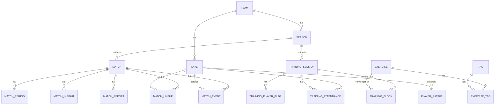

# Datenmodell

SQLite über GRDB.swift. Alle Primärschlüssel sind UUIDs (als TEXT). Jede Tabelle hat
`created_at` und `updated_at` (ISO-8601 UTC). JSON-Spalten sind mit `_json` gekennzeichnet.
Die Notation ist vereinfachtes SQL; die konkreten Migrationen entstehen im Code.

## 1. Überblick



## 2. Stammdaten

```sql
team (
  id TEXT PK, name TEXT, short_name TEXT, color_hex TEXT, is_active INTEGER
)

season (
  id TEXT PK, team_id TEXT FK, label TEXT,          -- "2026/27"
  starts_on TEXT, ends_on TEXT, is_current INTEGER
)

player (
  id TEXT PK, team_id TEXT FK,
  first_name TEXT, last_name TEXT, nickname TEXT,
  number INTEGER, primary_position TEXT,            -- TW, LV, LIV, RIV, RV, DM, ZM, LM, RM, OM, LA, RA, ST
  secondary_positions_json TEXT, foot TEXT,         -- rechts / links / beide
  birth_year INTEGER NULL,
  status TEXT,                                      -- aktiv / verletzt / abwesend / inaktiv
  notes TEXT
)
```

## 3. Spiel

```sql
match (
  id TEXT PK, season_id TEXT FK,
  kickoff_planned TEXT, opponent_name TEXT, venue TEXT,        -- heim / auswaerts
  competition TEXT,                                            -- liga / pokal / test
  attack_direction_first_half TEXT,                            -- links / rechts (aus Sicht des Beobachters)
  observer_side_flipped INTEGER,                               -- Darstellung spiegeln
  tracking_profile TEXT,                                       -- voll / kompakt / minimal
  formation TEXT,                                              -- "4-2-3-1"
  status TEXT,                                                 -- geplant / laeuft / beendet
  notes TEXT
)

match_period (
  id TEXT PK, match_id TEXT FK,
  number INTEGER,                                              -- 1, 2, 3 (Verl.), 4
  started_at TEXT NULL, ended_at TEXT NULL,                    -- reale Zeitstempel
  nominal_seconds INTEGER                                      -- 2700 für 45 Minuten
)

match_lineup (
  id TEXT PK, match_id TEXT FK, player_id TEXT FK,
  role TEXT,                                                   -- start / bank
  position_key TEXT NULL, number_in_match INTEGER
)
```

### 3.1 Event-Log

```sql
match_event (
  id TEXT PK, match_id TEXT FK,
  seq INTEGER,                    -- fortlaufende Nummer im Spiel, für stabile Sortierung
  period INTEGER,                 -- 1, 2, ...
  match_second INTEGER,           -- Sekunden seit Anpfiff der Periode (kann > nominal sein)
  occurred_at TEXT,               -- reale Uhrzeit
  side TEXT,                      -- wir / gegner / neutral
  type TEXT,                      -- Schlüssel aus dem Event-Katalog
  subtype TEXT NULL,              -- Standard-Typ, Karten-Typ, Tor-Art, ...
  outcome TEXT NULL,              -- tor / aufs_tor / vorbei / geblockt / gewonnen / verloren
  zone_row TEXT NULL, zone_lane TEXT NULL,
  zone_x REAL NULL, zone_y REAL NULL,   -- normalisierte Tap-Position 0..1
  player_id TEXT NULL,
  player_id_2 TEXT NULL,          -- Wechsel: eingewechselter Spieler
  position_key TEXT NULL,         -- Position des Spielers zum Zeitpunkt (aus Aufstellung + Wechseln abgeleitet, redundant gespeichert)
  flag_key TEXT NULL,
  note TEXT NULL,
  is_deleted INTEGER DEFAULT 0,   -- Undo = Soft-Delete
  edited_at TEXT NULL
)
CREATE INDEX idx_event_match ON match_event(match_id, seq);
CREATE INDEX idx_event_type ON match_event(match_id, type, side);
```

Regeln:

- Das Log ist append-only. Korrekturen setzen `edited_at`, Undo setzt `is_deleted`.
- `position_key` wird beim Speichern aus der aktuellen Aufstellung ermittelt, damit
  Positionsauswertungen ohne Rekonstruktion möglich sind.
- Tore sind `type = abschluss, outcome = tor`. Der Spielstand ist eine Abfrage, kein Feld.
- Wechsel sind `type = wechsel` mit `player_id` (raus), `player_id_2` (rein), `position_key`.

### 3.2 Abgeleitetes und Berichte

```sql
match_insight (
  id TEXT PK, match_id TEXT FK, period INTEGER, match_second INTEGER,
  rule_id TEXT, text TEXT, severity TEXT,            -- info / warn
  acknowledged INTEGER
)

match_report (
  id TEXT PK, match_id TEXT FK, kind TEXT,           -- halbzeit / ende
  generated_at TEXT, payload_json TEXT               -- vollständiger Bericht, damit er reproduzierbar bleibt
)

season_baseline (
  season_id TEXT, metric_key TEXT, value REAL, sample_size INTEGER, computed_at TEXT,
  PRIMARY KEY (season_id, metric_key)
)                                                    -- Cache, jederzeit neu berechenbar
```

## 4. Spielerbewertung

```sql
player_rating (
  id TEXT PK, player_id TEXT FK,
  source_type TEXT, source_id TEXT,                  -- match / training + jeweilige ID
  rated_at TEXT,
  technik INTEGER, taktik INTEGER, entscheidung INTEGER,
  zweikampf INTEGER, intensitaet INTEGER, kommunikation INTEGER,   -- je 1..5, NULL = nicht bewertet
  note TEXT
)
```

## 5. Training

```sql
training_session (
  id TEXT PK, season_id TEXT FK,
  scheduled_at TEXT, duration_minutes INTEGER,
  expected_players INTEGER,
  goals_json TEXT,                                   -- [{goal_key, weight}]
  generated_from_match_id TEXT NULL,
  generator_input_json TEXT NULL,                    -- Problem-Scores und Constraints zum Zeitpunkt der Erzeugung
  status TEXT,                                       -- geplant / durchgefuehrt / abgesagt
  notes TEXT
)

training_block (
  id TEXT PK, session_id TEXT FK, sort_order INTEGER,
  phase TEXT,                                        -- aktivierung / hauptteil / spielform / abschluss
  exercise_id TEXT NULL FK,                          -- NULL = freier Block
  title_override TEXT NULL,
  duration_minutes INTEGER, variant_key TEXT NULL,   -- einfacher / standard / schwerer
  reason_text TEXT NULL,                             -- "Warum diese Übung?"
  rating_worked INTEGER NULL, rating_intensity INTEGER NULL, rating_understood INTEGER NULL,
  notes TEXT
)

training_attendance (
  session_id TEXT FK, player_id TEXT FK,
  status TEXT,                                       -- anwesend / verletzt / entschuldigt / unentschuldigt
  PRIMARY KEY (session_id, player_id)
)

training_player_flag (
  id TEXT PK, session_id TEXT FK, player_id TEXT FK,
  flag_key TEXT NULL, text TEXT NULL, sentiment TEXT  -- positiv / neutral / negativ
)
```

## 6. Übungsbibliothek

```sql
exercise (
  id TEXT PK, name TEXT,
  goal_primary TEXT,                                 -- goal_key
  goals_secondary_json TEXT,                         -- [goal_key]
  players_min INTEGER, players_max INTEGER,
  duration_min INTEGER, duration_max INTEGER,
  intensity INTEGER,                                 -- 1..5
  field_width_m INTEGER, field_length_m INTEGER,
  material_json TEXT,                                -- [{item, count}]
  description TEXT, procedure TEXT,
  coaching_points_json TEXT,                         -- [string]
  variations_json TEXT,                              -- {easier: [string], harder: [string]}
  animation_json TEXT NULL,                          -- siehe Animationsformat
  source TEXT, is_favorite INTEGER, is_archived INTEGER
)

tag (key TEXT PK, label TEXT, category TEXT)         -- ziel / form / intensitaet / organisation
exercise_tag (exercise_id TEXT FK, tag_key TEXT FK, PRIMARY KEY (exercise_id, tag_key))

training_goal (
  key TEXT PK, label TEXT, description TEXT,
  default_tags_json TEXT                             -- Tags, die zu diesem Ziel passen
)
```

## 7. Regelwerk und Taktik

```sql
analysis_rule (
  id TEXT PK, name TEXT, kind TEXT,                  -- problem / live_insight / halbzeit
  definition_json TEXT,                              -- siehe Regelwerk-Dokument
  is_builtin INTEGER, is_active INTEGER, sort_order INTEGER
)

flag_catalog (
  key TEXT PK, label TEXT, group_name TEXT,          -- defensive / offensive / positiv
  weight REAL DEFAULT 1.0, goals_json TEXT,          -- [{goal_key, weight}]
  is_active INTEGER, sort_order INTEGER
)

tactics_preset (
  id TEXT PK, name TEXT, category TEXT,              -- aufbau / pressing / standard / umschalten / sonstiges
  own_formation TEXT, opponent_formation TEXT,
  board_json TEXT,                                   -- Tokens, Pfeile, Räume, PencilKit-Drawing (base64)
  animation_json TEXT NULL,
  notes TEXT
)

app_meta (key TEXT PK, value TEXT)                   -- schema_version, last_export_at, ...
```

## 8. Abgeleitete Kennzahlen (nie gespeichert, immer berechnet)

Die Statistik-Engine ist ein reines Swift-Modul, das eine Liste `MatchEvent` plus ein
Zeitfenster entgegennimmt und ein `MatchStats`-Struct liefert. Auszug:

| Kennzahl | Berechnung |
|---|---|
| Abschlüsse (wir/gegner) | count(type=abschluss) je Seite |
| Abschlüsse aufs Tor | outcome ∈ {tor, aufs_tor} |
| Tore | outcome = tor |
| Großchancen | count(type=grosschance) |
| Ballverluste Aufbau | type=ballverlust, side=wir, zone_row=eigenes_drittel |
| Ballverluste Zentrum | type=ballverlust, side=wir, zone_lane=zentrum |
| Hohe Ballgewinne | type=ballgewinn, side=wir, zone_row=angriffsdrittel |
| Angriffsverteilung | Anteil angriff je zone_lane |
| Gegner-Angriffe über unsere linke Seite | type=angriff, side=gegner, zone_lane=links |
| Pressing überspielt | count(type=pressing_ueberspielt) |
| Konter erhalten | type=konter, side=gegner |
| Flag-Häufigkeit | count(type=flag) je flag_key |
| Einsatzminuten je Spieler | aus lineup + wechsel + perioden |
| Fenster-Vergleich | dieselben Kennzahlen für zwei Zeitfenster |

Saisonbaselines sind Durchschnitte dieser Kennzahlen über alle beendeten Spiele der Saison
und werden in `season_baseline` gecacht.

## 9. Export-Bundle `.playlense`

ZIP-Datei mit:

```
manifest.json          -- app_version, schema_version, exported_at, team
playlense.sqlite       -- Snapshot der Datenbank (VACUUM INTO)
json/
  team.json, players.json, seasons.json
  matches/<match_id>.json      -- Match, Perioden, Aufstellung, Events, Insights, Reports
  trainings/<session_id>.json
  exercises.json, tags.json, goals.json, rules.json, flags.json, tactics.json
```

Das SQLite-Snapshot ist die Wiederherstellungsquelle. Die JSON-Dateien sind für Lesbarkeit,
Excel-Weiterverarbeitung und Merge nach UUID gedacht.
